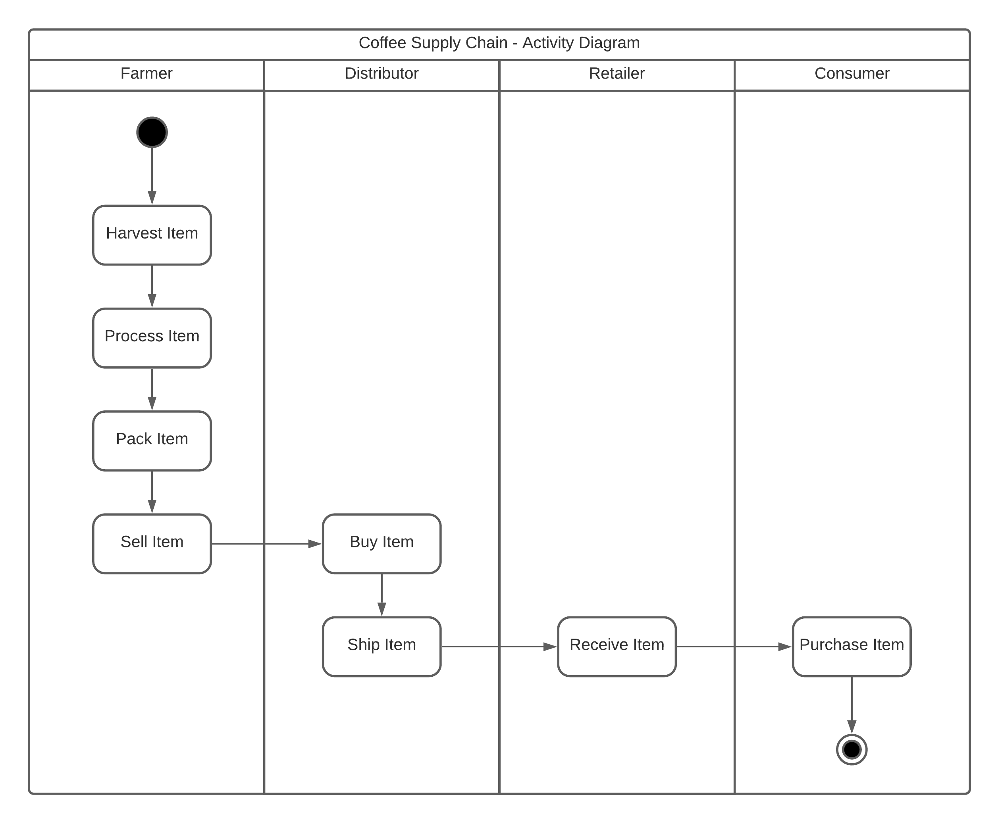
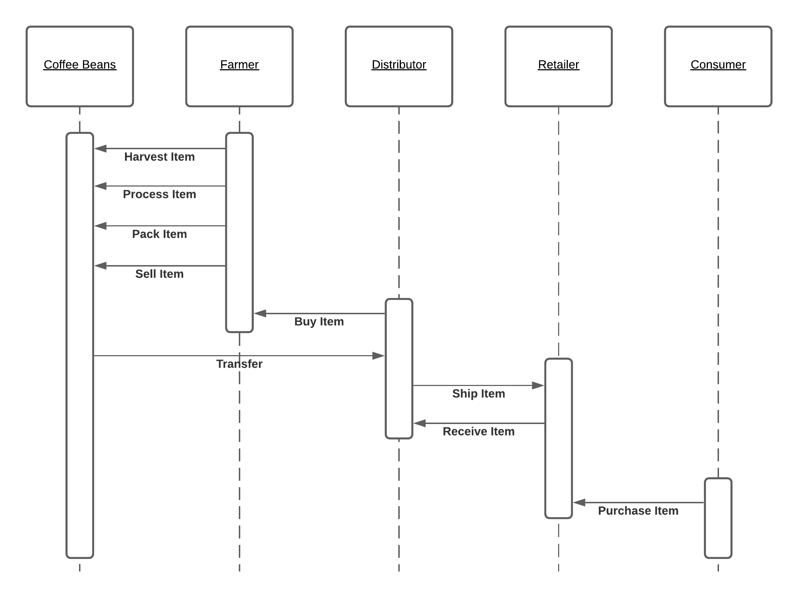
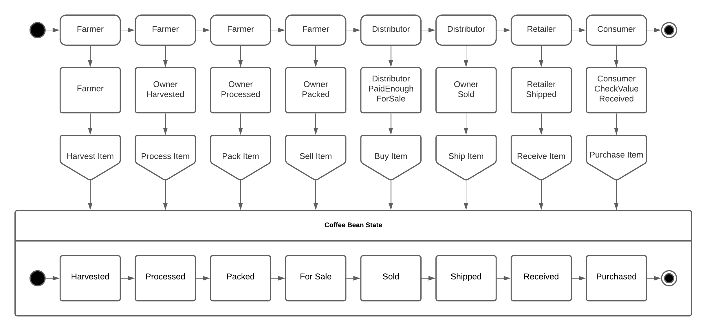

## Rinkeby Test Network Details

```
Account: 0x127b1291C1120dB198633dDc2dC61Ce75e096224
SupplyChain Contract Address: 0xF13e1EB04ffE233C56A2b0A3DC6cfa4D602f5752
ConsumerRole Contract Address: 0x11E6D1fde8a4Fd48333ec75C9e971A4f8A90399c
RetailerRole Contract Address: 0xC79893CE404b8A2b8e67a40171086B23Ebc1dF11
DistributorRole Contract Address: 0x8bf9b2596E08f349eD38a4de5ABe736e89d9DA0c
FarmerRole Contract Address: 0x1B1cB59907A1625B63eD0dE485464a237234Caf9
```

## Project Details

```
Node Version: 14.9.0
Truffle Version: 5.1.49
Web3 Version: 1.2.1
Solidity Version: 0.4.24
```

## Requirement 1: Project write-up - UML

### Activity Diagram



### Sequence Diagram



### State Diagram



### Data Modelling Diagram


## Requirement 2: Project write-up - Libraries

The library that was provided with the example codebase was maintained within the submission project, as it provided a common set of reusable functions for the actor roles. This allowed the role contracts to be secure, modular, prevent code duplication through reuse and reduce the new for future contract deployments.

## Requirement 3: Project write-up - IPFS

IPFS has not been used on this project to host the single-page app in a decentralised fashion. However, I could have used a combination of IPFS and Infura to pin the single-page app resources and point a DNS record to the Infura gateway.

## Run Instructions

```
git clone https://github.com/PaulAllen-310/supply-chain-project.git
npm install
truffle compile
start ganache, running on port 7545
truffle test
truffle migrate
npm run dev
```
